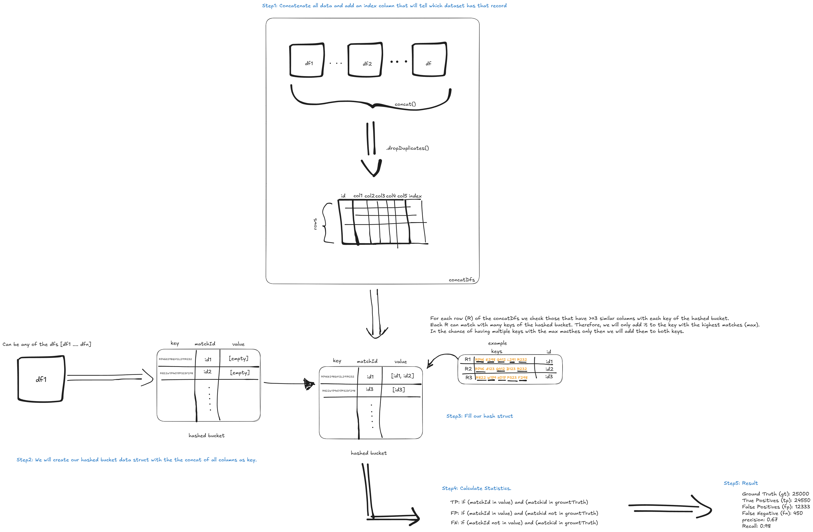

# Thesis Project

This project contains code and experiments for my thesis work. Below you will find instructions to set up, run, and understand the structure of the project.

The following diagram illustrates the overall data architecture of the project:


This diagram provides a visual overview of how data flows through the system, including data sources, processing steps, storage locations, and model interactions. Refer to this image for a better understanding of the relationships between different components and the sequence of operations within the project.

Entity Matching Pipeline
Overview
This repository contains a PySpark-based Multiparty entity matching designed for large-scale record linkage and deduplication. The system identifies and groups records that represent the same real-world entities across multiple datasets, even when exact matches are not possible due to variations in data formatting, spelling, or errors.

Problem Statement
In real-world scenarios, the same entity (person, organization, product) often appears differently across multiple datasets due to:

Spelling variations (e.g., "Smith" vs "Smyth")
Data entry errors and typos
Different formatting conventions
Incomplete information
This pipeline solves the entity resolution problem by finding and clustering these similar but non-identical records.

Pipeline Architecture
1. Data Ingestion
Loads multiple CSV datasets (df1, df2, df3, df4, df5)
Standardizes column schemas and adds data lineage tracking
Supports distributed processing with Apache Spark

2. Data Preprocessing
Soundex Transformation: Converts text to phonetic codes using the Jellyfish library
Example: "Smith" → "S530", "Smyth" → "S530"
Column Trimming: Configurable text preprocessing
Applied to all non-ID columns for fuzzy matching

3. Entity Matching Algorithm
Cross-join comparison between reference dataset (df1) and combined search space (df2-df5)
Column-wise similarity scoring (0-5 scale based on matching attributes)
Threshold filtering (≥3 matching columns required)
The algorithm identifies records with at least three matching columns and retains only those with the highest match score. If multiple records share the maximum score, all such records are included as matches.

4. Bucket Formation
Groups records into entity buckets representing the same real-world entity
Each bucket contains all records that matched to the same reference point
Preserves data lineage and matching confidence scores

5. Performance Evaluation
Precision: Accuracy of positive matches
Recall: Coverage of true matches
Comprehensive evaluation against ground truth data


## TODO

1. **Index Data with Origin Column**  
    Add an "origin" column to each dataframe to track the source dataset (e.g., df1, df2, etc.). This enables selective comparisons, such as comparing df1 only with df2 and df3, and prevents self-comparison within the same dataset.

2. **Selective Dataset Comparison**  
    Update the matching logic to ensure that reference records (e.g., from df1) are only compared against records from specified datasets (e.g., df2, df3), excluding self-comparisons.

3. **Example Update**  
    Adjust example code and documentation to reflect the use of the "origin" column, demonstrating how to filter out self-comparisons and ensure correct entity matching.

4. **Validation**  
    Test the updated pipeline to confirm that the origin-based filtering works as intended and that only the desired dataset pairs are compared.

5. **F1 Score**  
    Calculate the F1 score to provide a balanced measure of precision and recall. The F1 score is the harmonic mean of precision and recall, offering a single metric that balances both aspects of performance.

6. **Refactor PySpark Pipeline**  
    Move the existing PySpark entity matching pipeline code into a dedicated `pypsark_pipeline` package within the `packages/` directory. Update all relevant import statements and documentation to reflect this new structure for better modularity and maintainability.

-----------------------------------------------

7. **Vortex PySpark Pipeline Proposal**
    
    There is another variation of the multiparty record linkage (MRL) solution where we build a vortex that will store the total data in an indexed structure. This should 
    reduce complexity of the system, caching the MRL hashed data and be used later when requested by any party.


## Getting Started

1. **Clone the repository:**
```bash
git clone https://github.com/kostasrazgkelis/Thesis.git
cd Thesis
```

2. **Install dependencies:**
```bash
pip install -r requirements.txt
```


## Project Structure

- `packages/`  
  Contains reusable modules and utilities used throughout the project.

- `pipelines/`  
  Contains data processing and model training pipelines. Each pipeline is modular and can be run independently.

- `experiments/`  
  Contains experiment scripts and configurations. Each experiment is documented with its purpose and results.

- `doc/`  
    Contains all academic papers, references, and materials related to the theoretical foundations of the thesis. Use this directory to find background literature, methodology explanations, and supporting documents that inform the design and implementation of the project.

## Running Experiments
For now you should run the experiments with the jupyter notebook
Check the experiment script for configurable parameters.

## Notes
- All results and logs are saved in the `results/` directory.
- For more details on each package, refer to the docstrings and comments in the code.
